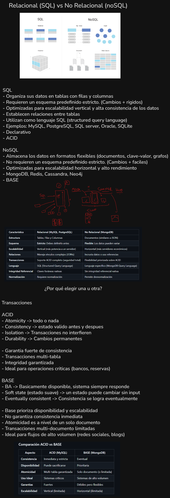

# Empezar acá — Guía de entrada a MongoDB

**Para quién es este documento:** para vos, si faltaste a la clase de transición, si estás
desorientado, o si querés tener en un solo lugar todo lo necesario para entender en qué nos
metimos.

No hace falta haber estado en la clase anterior. Empezá de arriba.

---

## Índice

1. [Dónde estamos parados](#1-dónde-estamos-parados)
2. [Relacional vs no relacional](#2-relacional-vs-no-relacional)
3. [Las familias NoSQL](#3-las-familias-nosql)
4. [ACID vs BASE](#4-acid-vs-base)
5. [Qué es MongoDB](#5-qué-es-mongodb)
6. [El vocabulario nuevo](#6-el-vocabulario-nuevo)
7. [Los tipos de datos](#7-los-tipos-de-datos)
8. [Qué instalar y cómo](#8-qué-instalar-y-cómo)
9. [Los primeros comandos](#9-los-primeros-comandos)
10. [Errores del primer día](#10-errores-del-primer-día)
11. [Chuleta SQL → MongoDB](#11-chuleta-sql--mongodb)

---

## 1. Dónde estamos parados

Venimos de cinco clases construyendo bases de datos **relacionales** con MySQL. En ese recorrido
aprendimos a:

- Crear bases y tablas con `CREATE TABLE`, eligiendo el tipo de cada columna
- Poner restricciones (`NOT NULL`, `UNIQUE`, `CHECK`) para que la base rechace datos malos
- Consultar con `SELECT`, filtrar con `WHERE`, agrupar con `GROUP BY`
- Combinar tablas con `JOIN`
- Declarar `FOREIGN KEY` para que la base impida datos imposibles

Ahora cambiamos de modelo. **MongoDB no tiene nada de eso.** No tiene tablas, ni `JOIN`, ni
`FOREIGN KEY`, ni esquema fijo.

Y no es que le falten: **las resigna a propósito**, a cambio de otras cosas.

> 🎯 **La idea que ordena todo el bloque:**
> MongoDB no es "SQL pero más fácil". Es un **conjunto distinto de compromisos**.
> Entender cuáles son es de lo que se trata esta materia.

---

## 2. Relacional vs no relacional



### El modelo relacional (SQL)

- Organiza los datos en **tablas** con filas y columnas
- Requiere un **esquema predefinido y estricto**: hay que declarar la estructura antes de guardar
  el primer dato, y cambiarla después cuesta
- Establece **relaciones entre tablas** mediante claves
- Usa **SQL** como lenguaje, que es **declarativo** (describís *qué* querés, no *cómo* buscarlo)
- Está optimizado para **escalabilidad vertical**: si necesitás más potencia, ponés un servidor
  más grande
- Garantiza **ACID** (ver sección 4)

**Ejemplos:** MySQL, PostgreSQL, SQL Server, Oracle, SQLite

### El modelo no relacional (NoSQL)

- Almacena los datos en **formatos flexibles**: documentos, clave-valor, grafos
- **No requiere esquema predefinido**: cada registro puede tener una forma distinta
- Está optimizado para **escalabilidad horizontal**: en vez de un servidor más grande, muchos
  servidores más chicos y baratos
- Sigue el modelo **BASE** en vez de ACID (ver sección 4)

**Ejemplos:** MongoDB, Redis, Cassandra, Neo4j

### La comparación, punto por punto

| Característica | Relacional (MySQL) | No relacional (MongoDB) |
|---|---|---|
| **Estructura** | Tablas, filas y columnas | Documentos (parecidos a JSON) |
| **Esquema** | **Estricto**: hay que definirlo antes | **Flexible**: los datos pueden variar |
| **Escalabilidad** | Vertical (más potencia a un servidor) | Horizontal (más servidores, más baratos) |
| **Relaciones** | Vínculos complejos con `JOIN` | Incrusta los datos, o usa referencias |
| **Transacciones** | Soporte ACID completo | Flexibilidad priorizada sobre ACID |
| **Lenguaje** | SQL, estándar entre motores | Lenguaje propio de cada motor |
| **Integridad referencial** | **Claves foráneas nativas** | **Sin integridad referencial nativa** |
| **Normalización** | La requiere | Permite desnormalización (duplicar a propósito) |

### Las dos filas que más importan

**Integridad referencial.** En MySQL declaramos `FOREIGN KEY` para que fuera **imposible** guardar
una inscripción de un estudiante que no existe. En MongoDB eso no existe: **podés guardar ese dato
imposible y nadie te avisa.** La responsabilidad de que no pase pasa a ser de tu código.

**Normalización.** En SQL el objetivo es que cada dato esté escrito **una sola vez**, y por eso se
separa en tablas. En Mongo pasa lo contrario: como no hay `JOIN`, la forma de traer todo de una es
tener el dato **duplicado adentro**. Se llama *desnormalización*, y es una decisión, no un error.

---

## 3. Las familias NoSQL

"NoSQL" no es una tecnología: es una etiqueta para todo lo que no es relacional. Adentro hay
familias muy distintas entre sí.

| Familia | Cómo guarda | Ejemplo | Para qué sirve |
|---|---|---|---|
| **Documental** | Documentos tipo JSON | **MongoDB** | Datos que se leen completos: perfiles, pedidos, catálogos |
| **Clave-valor** | Una clave apunta a un valor | Redis | Cachés, sesiones, contadores. Rapidísimo, muy simple |
| **Grafos** | Nodos y conexiones | Neo4j | Redes sociales, recomendaciones, rutas |
| **Wide column** | Columnas por fila, distribuido | Cassandra | Volúmenes enormes, series temporales |

**Nosotros vamos a usar la familia documental**, con MongoDB. Es la más parecida a lo que ya saben y
la más usada en desarrollo web.

---

## 4. ACID vs BASE

Son dos filosofías sobre qué garantizar cuando muchas cosas pasan al mismo tiempo.

### ACID — lo que garantiza una base relacional

| Letra | Qué significa |
|---|---|
| **A**tomicity | **Todo o nada.** Si una transferencia bancaria falla a la mitad, se cancela entera |
| **C**onsistency | La base pasa de un **estado válido a otro estado válido**. Las reglas se cumplen siempre |
| **I**solation | Dos operaciones simultáneas **no se interfieren** entre sí |
| **D**urability | Una vez confirmado, **queda**, aunque se corte la luz |

**Lo que te da:** garantía fuerte de consistencia, transacciones que abarcan varias tablas,
integridad garantizada.
**Ideal para:** operaciones críticas — bancos, reservas, facturación.

### BASE — la filosofía de las bases NoSQL

| Sigla | Qué significa |
|---|---|
| **B**asically **A**vailable | El sistema **siempre responde**, aunque sea con datos no del todo actualizados |
| **S**oft state | El estado **puede cambiar solo**, sin que nadie escriba, mientras la información se propaga entre servidores |
| **E**ventually consistent | Si dejás de escribir, en algún momento todos los servidores coinciden. **En algún momento** |

**Lo que te da:** disponibilidad y escalabilidad.
**Lo que resigna:** consistencia inmediata. La atomicidad existe solo **a nivel de un documento**.
**Ideal para:** flujos de alto volumen — redes sociales, blogs, logs.

### La tabla comparativa

| Aspecto | ACID (MySQL) | BASE (MongoDB) |
|---|---|---|
| **Consistencia** | Inmediata y estricta | Eventual |
| **Disponibilidad** | Puede sacrificarse | Prioritaria |
| **Atomicidad** | Multi-tabla garantizada | Solo a nivel de documento |
| **Uso ideal** | Sistemas críticos | Sistemas de alto volumen |
| **Garantías** | Fuertes | Débiles pero flexibles |
| **Escalabilidad** | Vertical (limitada) | Horizontal (ilimitada) |

### El ejemplo que lo hace entender

> Das like en un post. El contador dice **1.240**. Tu amigo, en otro país, lo ve en **1.239** durante
> dos segundos, hasta que la información termina de propagarse.
>
> **¿Es un problema?** No.
>
> **¿Y si en vez del contador de likes fuera tu saldo bancario?**

Ahí está toda la diferencia. No es que una sea mejor: es que **el costo de estar desactualizado dos
segundos cambia por completo según el dominio**.

### Un matiz honesto

**MongoDB tiene transacciones desde la versión 4.0.** La división ACID/BASE no es tan tajante como
suele contarse. Lo que sigue siendo cierto es el **diseño por defecto** de cada motor y hacia dónde
te empuja.

---

## 5. Qué es MongoDB

Una base de datos **documental**: en vez de filas en tablas, guarda **documentos** que se parecen
mucho a objetos JSON.

Un documento de MongoDB se ve así:

```js
{
  _id: 1,
  nombre: "firulais",
  especie: "perro",
  peso: 5.00,

  // 👇 un objeto adentro de otro objeto
  duenio: { nombre: "Mario", apellido: "Gomez Bolaños" },

  // 👇 una lista de objetos
  visitas: [
    { fecha: ISODate("2025-03-10"), motivo: "Control anual", costo: 15000 },
    { fecha: ISODate("2025-06-02"), motivo: "Vacunación",    costo: 9500 }
  ]
}
```

**Fijate en dos cosas que una tabla no puede hacer:**

1. El campo `duenio` **contiene otro objeto** adentro
2. El campo `visitas` **contiene una lista** de objetos

En MySQL esto habría necesitado **tres tablas** (`duenio`, `mascota`, `visita`) y dos `FOREIGN KEY`.
Acá es un solo documento, que se lee de una sola vez.

> 💡 **Si sabés leer JSON, sabés leer un documento de MongoDB.** Es lo mismo, con algunos tipos de
> dato extra.

---

## 6. El vocabulario nuevo

Todo lo que aprendiste tiene un equivalente. Lo que cambia es el nombre.

| MySQL | MongoDB |
|---|---|
| base de datos | base de datos |
| **tabla** | **colección** |
| **fila** / registro | **documento** |
| **columna** / campo | **campo** |
| `PRIMARY KEY` | `_id` |
| `WHERE` | el filtro del `find({ ... })` |
| `JOIN` | **no existe** (se embebe el dato) |
| `FOREIGN KEY` | **no existe** |
| esquema fijo | esquema flexible |

**Y una diferencia de fondo, que no es de vocabulario:**

> **MySQL:** primero declarás la estructura, después insertás.
> **MongoDB:** insertás, y la estructura aparece sola.

En SQL había dos familias de comandos: **DDL** para crear la estructura y **DML** para manipular los
datos. En Mongo esa línea prácticamente no existe: **no hay `CREATE TABLE`**. Las colecciones se
crean solas cuando insertás el primer documento.

---

## 7. Los tipos de datos

MongoDB guarda **BSON** (*Binary JSON*): JSON en formato binario, con más tipos que el JSON de texto.

### Los que vas a usar todo el tiempo

| Tipo | Cómo se escribe | Equivalente en MySQL |
|---|---|---|
| **String** | `"texto"` | `VARCHAR` / `TEXT` |
| **Double** | `3.14` · `42` | `DOUBLE` / `FLOAT` |
| **Boolean** | `true` / `false` | `BOOLEAN` |
| **Date** | `ISODate("2025-01-15")` | `DATE` / `DATETIME` |
| **Null** | `null` | `NULL` |
| **Array** | `[1, 2, 3]` | **no existe** |
| **Object** | `{ a: 1, b: 2 }` | **no existe** |
| **ObjectId** | `ObjectId("68f3a1...")` | el valor de una `PRIMARY KEY` |

### Los tipos numéricos, con cuidado

Esto importa y es fácil de pasar por alto:

| Tipo | Cómo se escribe | Cuándo |
|---|---|---|
| **Double** | `42` o `3.14` | Es el **default**. Cualquier número que escribas sin más |
| **Int32** | `NumberInt(42)` | Enteros, cuando querés ser explícito |
| **Int64** | `NumberLong(42)` | Enteros grandes |
| **Decimal128** | `NumberDecimal("15000.50")` | ⭐ **Dinero** |

> ⚠️ **Acordate de la clase de tipos en MySQL:** los precios van en `DECIMAL` y **nunca** en `FLOAT`,
> porque el punto flotante acumula errores de redondeo.
>
> **En MongoDB pasa exactamente lo mismo.** Si escribís `precio: 15000.50`, se guarda como
> **Double** — o sea, con el mismo problema. Para dinero va `NumberDecimal("15000.50")`.

### Las fechas

```js
fecha: ISODate("2025-01-15")     // ✅ es una FECHA
fecha: "2025-01-15"              // ❌ es un STRING
```

Si la guardás entre comillas, no vas a poder compararla ni ordenarla como fecha. **Es el mismo error
que guardar una fecha en un `VARCHAR` en MySQL.**

### El `_id` y el `ObjectId`

**Todo documento tiene un campo `_id`.** Es obligatorio, único, y es el equivalente exacto de la
`PRIMARY KEY`.

Si no se lo das, MongoDB genera uno automáticamente: un **ObjectId**, 12 bytes que incluyen la fecha
de creación, un identificador de la máquina y un contador.

```js
ObjectId("507f1f77bcf86cd799439011")
```

**Por qué no es un simple 1, 2, 3:** está pensado para que dos servidores distintos, generando ids al
mismo tiempo, nunca produzcan el mismo valor. Es la escalabilidad horizontal metida en el diseño del
identificador.

**Dato útil:** como el ObjectId incluye la fecha, se puede recuperar:

```js
db.mascota.findOne()._id.getTimestamp()
// 👀 la fecha y hora exactas de la inserción
```

Guardaste una fecha de creación sin quererlo. En MySQL hacía falta una columna
`creado_en TIMESTAMP DEFAULT CURRENT_TIMESTAMP`.

### Una consecuencia del esquema flexible

En MySQL, si una columna está declarada, **existe en todas las filas** — aunque esté en `NULL`.

En MongoDB no. Un campo puede **no estar**, y eso es distinto de estar en `null`:

```js
{ nombre: "roger", peso: 2.30 }     // tiene peso
{ nombre: "stuart" }                // NO TIENE el campo peso
{ nombre: "luna", peso: null }      // tiene el campo, vacío
```

Por eso existe una consulta que en SQL no tendría sentido:

```js
db.mascota.find({ peso: { $exists: false } })
```

---

## 8. Qué instalar y cómo

Igual que con MySQL, hacen falta **dos cosas**: un servidor y un cliente.

| | Qué es | Qué instalamos |
|---|---|---|
| **Servidor** | El motor que guarda los datos, corre en segundo plano | **MongoDB Community Server** |
| **Cliente** | Donde escribís consultas | **MongoDB Compass** (gráfico) y **mongosh** (consola) |

> 🎉 **Buena noticia:** el instalador de MongoDB los trae juntos. Es una sola descarga.

### Paso 1 — Descargar

**<https://www.mongodb.com/try/download/community>**

- **Version:** la que aparezca por defecto
- **Platform:** tu sistema operativo
- **Package:** `msi` en Windows

### Paso 2 — Instalar

#### 🪟 Windows
1. Ejecutá el `.msi` y elegí **Complete**
2. ⚠️ En la pantalla **"Service Configuration"**, dejá tildado **"Install MongoDB as a Service"**.
   Esto hace que MongoDB **arranque solo con Windows** — a diferencia de XAMPP, no vas a tener que
   encenderlo cada vez
3. ⚠️ En la pantalla siguiente, dejá tildado **"Install MongoDB Compass"**
4. Terminar

#### 🍎 macOS
```bash
brew tap mongodb/brew
brew install mongodb-community
brew services start mongodb-community
```
Compass se baja aparte de <https://www.mongodb.com/try/download/compass>

#### 🐧 Linux
Seguí las instrucciones de tu distro en
<https://www.mongodb.com/docs/manual/administration/install-on-linux/> y después:
```bash
sudo systemctl start mongod
sudo systemctl enable mongod
```

### Paso 3 — Conectar

1. Abrí **MongoDB Compass**
2. Va a aparecer una cadena de conexión ya cargada:
   ```
   mongodb://localhost:27017
   ```
3. **Connect**

✅ Si entrás y ves bases a la izquierda (`admin`, `config`, `local`), **funciona**.

> El `27017` es el puerto de MongoDB, igual que el `3306` era el de MySQL.

### Paso 4 — Probar

Compass trae una consola integrada abajo de todo: la pestaña **`>_MONGOSH`**. Hacé clic y escribí:

```js
db.version()
```

✅ Si devuelve un número, terminaste.

### ✅ Checklist

- [ ] MongoDB instalado
- [ ] Compass abre
- [ ] Compass conecta a `mongodb://localhost:27017`
- [ ] `db.version()` devuelve un número

> ⚠️ **No desinstales MySQL ni XAMPP.** Vamos a seguir comparando los dos modelos.

---

## 9. Los primeros comandos

Todo esto va en la consola `>_MONGOSH` de Compass.

### Orientarse

```js
show dbs           // qué bases existen
db                 // en qué base estoy parado
use veterinaria    // pararme en una base
show collections   // qué colecciones tiene
```

### ⚠️ Algo que sorprende

```js
use unabasequenoexiste
// 👀 "switched to db unabasequenoexiste"  →  y NO da error
```

Estás parado en una base que no existe. **Es normal en Mongo.** La base se va a crear sola cuando
insertes el primer documento.

### Las cinco operaciones básicas

```js
// INSERTAR
db.mascota.insertOne({ nombre: "firulais", especie: "perro" })
db.mascota.insertMany([ { ... }, { ... } ])

// LEER
db.mascota.find()                          // todos
db.mascota.find({ especie: "perro" })      // filtrados
db.mascota.findOne({ _id: 1 })             // uno solo
db.mascota.countDocuments()                // contar

// ACTUALIZAR
db.mascota.updateOne({ _id: 1 }, { $set: { peso: 5.40 } })
db.mascota.updateMany({ especie: "conejo" }, { $set: { alimentacion: "herbívora" } })

// BORRAR
db.mascota.deleteOne({ _id: 1 })
db.mascota.deleteMany({ especie: "ave" })

// TIRAR LA COLECCIÓN ENTERA
db.mascota.drop()
```

> ⭐ **Lo más importante de esta lista:** el `$set` del `updateOne`. **Nunca lo omitas.** Sin él, o
> falla, o (con `replaceOne`) reemplaza el documento entero y perdés todos los campos que no
> mencionaste.

---

## 10. Errores del primer día

| Síntoma | Qué está pasando |
|---|---|
| `connect ECONNREFUSED 127.0.0.1:27017` | El servidor no está corriendo. En Windows: `services.msc` → **MongoDB Server** → Iniciar |
| **"Inserté y no aparece nada"** | Estás parado en otra base (escribí `db`) o escribiste mal el nombre de la colección (`show collections`) |
| **"La colección se duplicó"** | Un typo. ⚠️ Ver abajo |
| `Update document requires atomic operators` | Te falta el `$set` |
| **"Se me perdieron campos al actualizar"** | Usaste `replaceOne` en vez de `updateOne` con `$set` |
| `E11000 duplicate key error` | Estás repitiendo un `_id`. Es el "Duplicate entry" de MySQL |
| `find({ peso: "5" })` no devuelve nada | Estás comparando **texto** contra **número**. Mongo no convierte tipos |
| `db.x.find().nombre` da `undefined` | `find` devuelve un **cursor**, no un documento. Usá `findOne` |
| No podés cambiar el `_id` | Es inmutable. Hay que borrar e insertar de nuevo |

### ⚠️ El error que más va a costar

```js
db.duenio.insertOne({ ... })    // la colección correcta
db.duenios.insertOne({ ... })   // 👈 un typo en plural
```

**MySQL te habría dicho `Table 'duenios' doesn't exist`. MongoDB te crea una colección nueva** y te
deja seguir trabajando en el lugar equivocado, sin avisar nada.

> 🎯 **La regla:** un typo en el nombre de una colección **no da error**.
> Cuando algo "no aparece", lo primero que se revisa es `show collections`.

---

## 11. Chuleta SQL → MongoDB

| SQL | MongoDB |
|---|---|
| `CREATE DATABASE x` | *(no existe: se crea sola)* |
| `USE x` | `use x` |
| `CREATE TABLE x (...)` | *(no existe: se crea sola al insertar)* |
| `SHOW TABLES` | `show collections` |
| `DESCRIBE x` | *(no existe: no hay esquema que describir)* |
| `INSERT INTO x VALUES (...)` | `db.x.insertOne({ ... })` |
| `SELECT * FROM x` | `db.x.find()` |
| `SELECT a, b FROM x` | `db.x.find({}, { a: 1, b: 1, _id: 0 })` |
| `WHERE campo = valor` | `db.x.find({ campo: valor })` |
| `WHERE a = 1 AND b = 2` | `db.x.find({ a: 1, b: 2 })` |
| `ORDER BY campo DESC` | `.sort({ campo: -1 })` |
| `LIMIT n` | `.limit(n)` |
| `LIMIT n OFFSET m` | `.skip(m).limit(n)` |
| `COUNT(*)` | `db.x.countDocuments()` |
| `UPDATE x SET a = 1 WHERE ...` | `db.x.updateOne({ ... }, { $set: { a: 1 } })` |
| `DELETE FROM x WHERE ...` | `db.x.deleteOne({ ... })` |
| `DROP TABLE x` | `db.x.drop()` |
| `TRUNCATE x` | `db.x.deleteMany({})` |
| `JOIN` | *(no existe: se embebe el dato)* |
| `FOREIGN KEY` | *(no existe)* |
| — | `db.x.find({ campo: { $exists: false } })` |

---

## Lo que se lleva quien leyó hasta acá

1. **MongoDB guarda documentos tipo JSON**, con objetos anidados y listas adentro. Una tabla no
   puede hacer eso.
2. **No hay `CREATE`**: las bases y colecciones se crean solas al insertar. Cómodo, y por eso un
   typo no da error.
3. **No hay `FOREIGN KEY`**: la integridad referencial pasa a ser responsabilidad de tu código.
4. **El esquema es flexible**: un campo puede no existir, y eso no es lo mismo que estar en `null`.
5. **Para dinero, `NumberDecimal`.** Para fechas, `ISODate`. Los mismos cuidados que en SQL.
6. **Para actualizar, siempre `$set`.**

> **Ninguna de las dos es mejor. Son compromisos distintos.**
> Elegir bien es saber qué estás entregando a cambio de qué.
