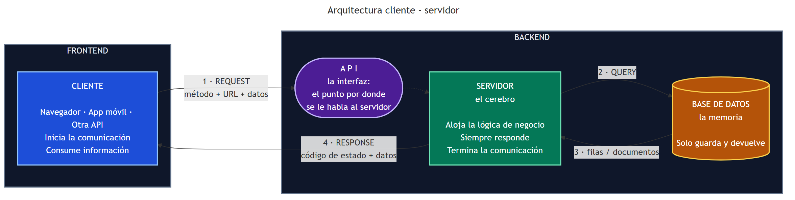

# Empezar acá — Express y la arquitectura cliente-servidor

**Para quién es este documento:** para vos, si faltaste a la clase, si te perdiste en algún momento,
o si querés tener en un solo lugar todo lo que vimos.

No hace falta saber nada de antes. Empezá de arriba.

---

## Índice

1. [Dónde estamos parados](#1-dónde-estamos-parados)
2. [La arquitectura cliente-servidor](#2-la-arquitectura-cliente-servidor)
3. [Quién hace qué](#3-quién-hace-qué)
4. [La API y la palabra "interfaz"](#4-la-api-y-la-palabra-interfaz)
5. [Frontend y backend](#5-frontend-y-backend)
6. [El vocabulario nuevo](#6-el-vocabulario-nuevo)
7. [Qué instalar](#7-qué-instalar)
8. [Armar el proyecto desde cero](#8-armar-el-proyecto-desde-cero)
9. [El código de la clase, línea por línea](#9-el-código-de-la-clase-línea-por-línea)
10. [Cómo mandarle datos al servidor](#10-cómo-mandarle-datos-al-servidor)
11. [HTTP: métodos y códigos de estado](#11-http-métodos-y-códigos-de-estado)
12. [Errores del primer día](#12-errores-del-primer-día)
13. [Chuleta](#13-chuleta)

---

## 1. Dónde estamos parados

Venimos de nueve clases guardando datos: primero en MySQL, después en MongoDB. Aprendimos a crear
tablas, consultar, relacionar, agrupar.

Pero todo eso lo hicimos **nosotros, a mano**, escribiendo consultas en una terminal. Nadie más
podía usar esos datos.

Hoy empezamos a construir **el programa que va en el medio**: el que recibe pedidos de otros
programas, decide qué hacer, le pregunta a la base de datos y responde.

Y hay algo nuevo, que no es un detalle:

> 🎯 **Todos los programas que escribieron hasta hoy arrancan, hacen algo y terminan.**
> **El de hoy arranca y se queda.** Esperando. Sin hacer nada, hasta que alguien le pida algo.
>
> Eso es un **servidor**.

La analogía que usamos en clase: sus programas anteriores eran un **mensajero** — sale, hace el
mandado, vuelve, se terminó. Un servidor es un **local con las puertas abiertas**: está ahí, no hace
nada la mayor parte del tiempo, y cuando entra alguien lo atiende. Hasta que vos bajás la persiana.

---

## 2. La arquitectura cliente-servidor



Este es el mapa completo de lo que vamos a construir en las próximas clases. Leelo de izquierda a
derecha y después de derecha a izquierda:

1. El **cliente** manda una **request** (una petición): *"dame los usuarios"*.
2. El **servidor** la recibe, la entiende, y decide qué hacer.
3. Si necesita datos, le manda una **query** a la **base de datos**.
4. La base le devuelve las filas o los documentos.
5. El servidor arma la **response** (la respuesta) y se la manda al cliente.

**Y ahí termina.** El servidor vuelve a no hacer nada, esperando el próximo pedido.

Las tres piezas tienen un rol muy distinto, y conviene fijarlo con estas tres palabras:

| Pieza | Es… | Porque… |
|---|---|---|
| Cliente | **La cara** | Es lo único que el usuario ve y toca |
| Servidor | **El cerebro** | Es donde se toman las decisiones |
| Base de datos | **La memoria** | Solo guarda y devuelve. No decide nada |

> ⚠️ **La base de datos no piensa.** Si tu base está "decidiendo" cosas, o si tu servidor solo
> reenvía datos sin hacer nada, algo se corrió de lugar.

---

## 3. Quién hace qué

### El cliente

- **Inicia** la comunicación
- **Solicita** información (*request*)
- **Consume** información

Un cliente no es necesariamente una persona con un navegador. Cliente es **cualquier programa que
pide**:

- Un **frontend** (una página web)
- Una **app móvil**
- **Otra API** — un servidor puede ser cliente de otro servidor

### El servidor

- **Siempre, siempre responde** — aunque sea para decir "eso no existe"
- **Finaliza** la comunicación
- **Recibe** solicitudes y responde (*response*)
- También **solicita** información: cuando le habla a la base de datos, el cliente es él
- **Aloja la lógica de negocio**

> 🧠 **La regla que ordena todo:** el cliente empieza la conversación, el servidor la termina.
> El servidor **nunca** arranca solo. Si nadie le pide nada, no hace nada.

### La base de datos

Guarda y devuelve. Nada más. Ya la conocen de las clases 5 a 13.

---

## 4. La API y la palabra "interfaz"

**API** = *Application Programming Interface* — interfaz de programación de aplicaciones.

La palabra que importa es **interfaz**:

> **Interfaz = punto de interacción entre dos entidades.**

El volante es la interfaz entre vos y el auto: no necesitás saber cómo funciona la dirección
hidráulica, solo girás. La API es lo mismo entre el cliente y el servidor: **el cliente no sabe (ni
le importa) cómo está hecho el servidor por dentro**. Solo sabe qué direcciones puede pedir y qué le
van a devolver.

Por eso decimos que la API es **un puente**.

### ¿Y el MVC?

**MVC** = Modelo - Vista - Controlador. Es otra forma de organizar un servidor, en la que **las
vistas (el HTML) se generan del lado del servidor** y se mandan ya armadas al navegador.

> ❓ **¿Por qué en MVC "desaparece" la API?**
>
> Porque **la API es un puente, y en MVC está todo integrado.** No hay dos aplicaciones separadas
> que necesiten hablarse: el servidor genera la pantalla y la manda. No hay nada que puentear.

En una API REST, en cambio, el frontend es **una aplicación aparte** que vive por su cuenta y se
comunica con el backend pidiendo datos. Ahí sí hace falta el puente.

### Cómo se organiza un servidor por dentro

| Arquitectura | Qué es |
|---|---|
| **Monolítica** | Todo el servidor es un solo programa. Más simple de arrancar |
| **Microservicios** | Muchos servidores chicos, cada uno con una responsabilidad |

Nosotros vamos a trabajar **monolítico** todo el cuatrimestre. Los microservicios son una solución
a un problema de escala que todavía no tenemos.

---

## 5. Frontend y backend

**El backend es agnóstico.** Quiere decir que no le importa quién lo consuma: la misma API le
responde igual a una página web, a una app de Android o a otro servidor. Devuelve datos, no
pantallas.

Y ya que estamos, la comparación honesta entre los dos mundos:

| Criterio | Frontend | Backend |
|---|---|---|
| **Reconocimiento** | **Se lleva los elogios.** Es lo que el usuario ve, prueba y compra: si le gusta la pantalla, siente que le gusta el producto | **Es invisible.** Cuando funciona bien, nadie se entera de que existe |
| **Quejas** | **Se lleva los reclamos.** Si algo falla o va lento, el usuario le echa la culpa a la pantalla — aunque el problema esté en otro lado | **Está protegido.** El usuario nunca interactúa con él directamente |
| **Qué lo hace atractivo** | **Entra por los ojos:** el diseño, los colores, las animaciones | **Es estructural:** que sea rápido, exacto y estable |
| **Relación con el usuario** | **Lo conquista.** Le da una experiencia cómoda, fluida y fácil de entender | **Le da confianza.** Garantiza que sus datos y sus pagos estén seguros |
| **Mantenimiento** | **Alto.** Cambia todo el tiempo: celulares nuevos, pantallas nuevas, modas de diseño nuevas | **Bajo, si está bien hecho.** Corre en servidores controlados: si la base es sólida, no se toca durante años |
| **Tamaño del equipo** | **Más grande.** Hace falta gente para interfaz, experiencia de usuario, que se vea bien en cada pantalla, accesibilidad y maquetado | **Más chico.** Un grupo reducido maneja la lógica de todo el sistema |
| **Rol principal** | **Presentar.** Mostrar los datos y capturar lo que el usuario hace | **Es crítico.** Maneja la lógica de negocio, las bases de datos y la seguridad |
| **Si algo falla** | Molesta a la vista, o se traba una pantalla | Se filtran datos, fallan los cobros, o se cae el sistema entero |

> 💡 Ninguno es mejor. Son trabajos distintos, con problemas distintos. Pero fijate en la última
> fila: **cuando el frontend falla, alguien se enoja; cuando el backend falla, alguien pierde
> plata o datos.** Por eso decimos que el backend es crítico.

---

## 6. El vocabulario nuevo

Estas palabras van a aparecer todo el cuatrimestre. Vale la pena leerlas dos veces.

### Puerto

**Por dónde entran los pedidos** a tu máquina. Es un número.

Si tu computadora fuera una galería comercial, el puerto es **el número del local**. La dirección
te lleva a la galería; el número te lleva al local exacto.

Nosotros usamos el **3000**. Un puerto lo puede reservar **un solo programa a la vez**.

### Localhost

**Tu propia máquina.** `localhost:3000` es tu computadora hablándose a sí misma.

> ⚠️ No está en internet. **Nadie más lo puede ver.** Si le pasás `http://localhost:3000` a un
> compañero, va a abrir *su* máquina, no la tuya.

### Lógica de negocio

> **El conjunto de reglas, condiciones y procesos que determinan cómo un software toma decisiones,
> procesa datos y resuelve un problema real del mundo.**

Ejemplos concretos: *"un usuario no puede reservar dos turnos el mismo día"*, *"si el pedido supera
los $50.000 el envío es gratis"*, *"solo el dueño de la publicación puede borrarla"*.

**Eso vive en el servidor.** No en la base de datos, y no en el frontend.

### Sobreingeniería

> **El diseño de un producto, sistema o pieza de software para que sea más complejo, robusto o
> avanzado de lo estrictamente necesario.**

Y acá va el punto que conecta con lo anterior:

> ⚠️ **Si tu frontend tiene lógica de negocio, estás generando sobreingeniería.** Terminás
> escribiendo dos veces la misma regla, en dos lenguajes distintos, y el día que cambie vas a
> arreglar una sola.

### Deuda técnica

> **El costo adicional y el esfuerzo futuro que genera elegir una solución rápida o un atajo en el
> desarrollo de software, en lugar de una implementación óptima a largo plazo.**

No es "código feo". Es un **préstamo**: hoy entregás más rápido, y lo pagás más adelante con
intereses. A veces vale la pena tomarlo. Lo que no vale es tomarlo sin darse cuenta.

### REST y RESTful

> **REST es el estilo arquitectónico** — el conjunto de reglas y principios.
> **RESTful es el adjetivo** que describe a un sistema o API que implementa y cumple fielmente con
> esos principios.

REST es el reglamento; RESTful es "esta API juega según ese reglamento".

Una **API REST**:
- Usa el protocolo **HTTP** con sus métodos: `GET`, `POST`, `PUT`, `PATCH`, `DELETE`
- Maneja los **códigos de estado** de HTTP

### SaaS

*Software as a Service.* **Alquilar** software en vez de comprarlo e instalarlo. Gmail, Spotify,
Netflix. Pagás por usarlo, no lo tenés.

---

## 7. Qué instalar

### Node.js

Verificá si ya lo tenés:

```bash
node --version
npm --version
```

Tenés que ver **dos números de versión**. Si dice `command not found` o `no se reconoce`,
descargalo de [nodejs.org](https://nodejs.org/) — la opción **LTS**.

> ⚠️ Después de instalar, **cerrá y volvé a abrir la terminal**. Si no, sigue sin encontrarlo.

`npm` viene junto con Node. No se baja aparte.

### Postman

Sirve para probar el servidor sin tener una página web todavía. Descargalo de
[postman.com/downloads](https://www.postman.com/downloads/).

Cuando lo abrís te pide crear una cuenta: **no hace falta**, abajo hay un link que dice
*"Skip and go to the app"*.

### El puerto 3000 libre

Abrí `http://localhost:3000` en el navegador.

- ✅ Si dice **"no se puede acceder a este sitio"** → está libre, perfecto.
- ⚠️ Si aparece **alguna página** → tenés algo corriendo ahí (un proyecto de React, de Next…).
  Cerralo antes de arrancar.

---

## 8. Armar el proyecto desde cero

Esta parte parece burocracia y no lo es. **La mitad de los problemas del cuatrimestre arrancan
acá.** Hacela despacio una vez y después te sale sola.

Partimos de una **carpeta vacía**.

### Paso 1 — Declarar que esto es un proyecto de Node

```bash
npm init -y
```

`npm` es el gestor de paquetes de Node. `init` crea el proyecto. El `-y` significa *"decí que sí a
todo y no me preguntes nada"*.

Apareció **un solo archivo**: `package.json`.

```json
{
  "name": "14",
  "version": "1.0.0",
  "main": "index.js",
  "scripts": { ... },
  "license": "ISC"
}
```

> 📄 **`package.json` es el documento de identidad del proyecto.** Dice cómo se llama, qué versión
> es, con qué archivo se ejecuta y — lo más importante — **de qué depende**.

### Paso 2 — Instalar Express

```bash
npm install express
```

Cuando termina, mirá el explorador de archivos: **aparecieron tres cosas**.

**1. `package.json` cambió.** Tiene una sección nueva que **se escribió sola**:

```json
"dependencies": {
  "express": "^5.2.1"
}
```

Ahora el proyecto *declara* que necesita Express. El `^` significa "esta versión o cualquier
actualización menor compatible".

**2. Apareció `node_modules/`.** Abrila: tiene decenas de carpetas.

> Instalamos **un** paquete y aparecieron **sesenta**. Porque Express también depende de otras
> librerías, y esas de otras. Acá adentro está el código real de Express.
>
> ⚠️ **Esta carpeta nunca se toca y nunca se sube al repositorio.** Pesa mucho y se regenera entera
> con un `npm install`.

**3. Apareció `package-lock.json`.** Guarda la versión **exacta** de cada uno de esos sesenta
paquetes. Es lo que hace que a vos y a mí nos instale exactamente lo mismo. Este **sí** va al repo,
y no se edita a mano.

### Paso 3 — El `.gitignore`

Creá un archivo llamado `.gitignore` con esto adentro:

```
node_modules/
.env
```

`node_modules` porque se regenera. `.env` porque más adelante va a tener contraseñas.

### El resumen

```
mi-proyecto/
├── node_modules/       ← el código de las librerías    NO va al repo
├── package.json        ← qué necesita el proyecto      SÍ va al repo
├── package-lock.json   ← qué versión exacta            SÍ va al repo
├── .gitignore          ← qué NO subir                  SÍ va al repo
└── index.js            ← nuestro código                SÍ va al repo
```

> 💡 Cuando clonás un proyecto de GitHub **no viene `node_modules`**. Viene `package.json`. Corrés
> `npm install`, npm lo lee y te baja todo lo que dice ahí. Por eso importa que esté bien.

### Paso 4 — ⭐ `import` o `require`

Esta decisión los va a perseguir todo el cuatrimestre, así que conviene entenderla ahora.

| ESM (moderno) | CommonJS (clásico) |
|---|---|
| `import express from "express"` | `const express = require("express")` |
| `export default app` | `module.exports = app` |
| `package.json` **con** `"type": "module"` | `package.json` **sin** esa línea |

Hacen lo mismo: traer un módulo. **No se pueden mezclar en el mismo archivo.**

Y cuál usás **no lo elegís archivo por archivo**: lo decide **una línea del `package.json`**.
Nosotros usamos `import`, así que agregamos:

```json
"type": "module",
```

> 🐞 Si copiás código de un tutorial que usa `require` y te tira
> `require is not defined in ES module scope`, ya sabés dónde mirar.

### Paso 5 — Los scripts

En el `package.json`:

```json
"scripts": {
  "start": "node index.js",
  "dev": "node --watch index.js"
}
```

Ahora hay tres formas de correr lo mismo:

```bash
node index.js      # directo
npm start          # a través del script
npm run dev        # con recarga automática al guardar
```

- **`npm start`** es el nombre estándar: en cualquier proyecto de Node del mundo, `npm start` lo
  levanta. No hace falta leer el código para saber cómo se arranca.
- **`--watch`** viene incluido en Node y **reinicia el servidor solo** cada vez que guardás. Sin
  eso, cada cambio es Ctrl+C y volver a arrancar.

> ⚠️ `start` es el único que funciona sin `run`. Todos los demás necesitan `npm run <nombre>`.

---

## 9. El código de la clase, línea por línea

Este es el `index.js` que escribimos, entero, explicado.

### Las dos primeras líneas

```js
import express from 'express'

// express() devuelve un objeto, ese objeto es nuestro servidor
// todo lo que le pidamos al servidor se lo pedimos a app
const app = express()
```

Fijate que en el `import` el nombre va **pelado**: sin `./` y sin `.js`. Eso le dice a Node *"esto
no es un archivo mío, buscalo en `node_modules`"*.

`express()` devuelve un objeto. **Ese objeto es nuestro servidor.** De acá en adelante, todo lo que
le pidamos al servidor se lo pedimos a `app`.

### La primera ruta

```js
app.get("/", (req, res) => {
    res.send("Servidor funcionando!!")
})
```

Se lee: **"cuando llegue un GET a la dirección `/`, ejecutá esta función"**.

```
   app.get(  "/" ,  (req, res) => { ... }  )
        │     │              │
        │     │              └─ qué hacer cuando llegue
        │     └──────────────── a qué dirección
        └────────────────────── con qué método HTTP
```

- **`req`** es **la petición que llegó**: qué pidieron, con qué datos
- **`res`** es **la respuesta**: lo que le vamos a contestar

> ⚠️ **Esa función no se ejecuta ahora.** Queda guardada, esperando. Se ejecuta cada vez que llegue
> un pedido a esa dirección.

### La línea que lo mantiene vivo

```js
const PORT = 3000;

app.listen(PORT, () => {
    console.log(`Servidor escuchando en http://localhost:${PORT}`)
})
```

**Esta es LA línea.** `listen` le dice al sistema operativo: *"reservame el puerto 3000 y avisame
cada vez que llegue algo ahí"*. Y eso **deja el proceso corriendo**.

Cuando lo corrés, mirá dos cosas en la terminal:

1. Salió el mensaje del `console.log`
2. **El cursor no volvió.** No hay prompt. El programa está corriendo

> 🐞 **Si sacás `app.listen`, no hay ningún error.** El programa arranca, registra las rutas, llega
> al final y termina — porque no le queda nada por hacer. **Si tu servidor "no hace nada", eso es lo
> primero que hay que revisar.**

Frenalo con **Ctrl + C**.

### El manejador de 404

```js
// .status(n) -> define el codigo de estado enviado
// .json({})  -> permite mandar json
app.use((req, res) => {
    res.status(404).json({ error: "Esa direccion no existe" })
})
```

Este bloque **no tiene dirección**: coincide con todo.

Express prueba las rutas **en orden, de arriba hacia abajo**, y se queda con la primera que
coincide. Si un pedido llegó hasta acá abajo, es porque **ninguna otra ruta lo agarró**: la
dirección no existe.

> ⚠️ **Va siempre último.** Si lo ponés arriba, atrapa todo y ninguna otra ruta se ejecuta nunca.

Y sobre `res.status(404).json(...)`:

- `.status(404)` **no responde**: solo deja anotado el número
- `.json({...})` es el que manda la respuesta

Por eso van encadenados. Si escribís `res.status(404)` solo, la petición **queda cargando para
siempre**.

### `send` vs `json`

```js
res.send("Servidor funcionando!!")   // manda texto
res.json({ mensaje: "Hola" })        // manda un objeto
```

**Vamos a usar `json` el 95% del tiempo.** Una API no devuelve texto para que lo lea una persona:
devuelve **datos para que los use otro programa**. `send` es para probar.

> 💡 En el `index.js` de la clase quedó comentado un `res.send()` con una página HTML entera
> adentro. Funciona — y es exactamente lo que hace un servidor **MVC**. Pero eso ya no es una API:
> es un servidor que devuelve pantallas en vez de datos.

---

## 10. Cómo mandarle datos al servidor

Un cliente le puede mandar datos al servidor por **tres caminos distintos**. Los tres se usan, y
para cosas distintas.

### Forma 1 — Route params: parte de la URL

```js
// Datos que viajan por get, viajan por ruta
app.get("/usuarios/:id", (req, res) => {
    res.json({
        mensaje: "Me pediste un usuario",
        id: req.params.id,
        tipo: typeof req.params.id
    });
});
```

Los **dos puntos** convierten ese tramo de la URL en una variable. `"/usuarios/:id"` coincide con
`/usuarios/7`, `/usuarios/pepe`, `/usuarios/abc`.

Probá `http://localhost:3000/usuarios/7`:

```json
{ "mensaje": "Me pediste un usuario", "id": "7", "tipo": "string" }
```

> ⚠️ **Miralo bien: el 7 llegó como `"7"`, entre comillas.**
>
> **Todo lo que viene por la URL es texto.** Si vas a compararlo con un número, convertilo:
> `Number(req.params.id)`. Si no, `3 === "3"` da `false` y **nunca vas a encontrar nada**.
>
> Por eso la ruta imprime el `typeof`: para que se vea.

Se pueden **encadenar** varios:

```js
app.get("/materias/:materia/alumnos/:legajo", (req, res) => {
    res.json({
        materia: req.params.materia,
        legajo: req.params.legajo
    })
})
```

`/materias/backend/alumnos/1234` → `{ "materia": "backend", "legajo": "1234" }`

> 🔑 Los route params son **obligatorios**: son parte de la ruta. Sin ellos la dirección no
> coincide con nada. Sirven para decir **a quién** le estás hablando.

### Forma 2 — Query params: lo que va después del `?`

```js
// Query params -> es similar a request params PERO no es obligatoria
app.get("/buscar", (req, res) => {
    res.json({
        recibi: req.query
    })
})
```

**No se declaran en la ruta.** Express arma `req.query` solo, con lo que venga después del signo de
pregunta, separado por `&`.

| Petición | `req.query` |
|---|---|
| `/buscar` | `{}` |
| `/buscar?ciudad=rosario` | `{ "ciudad": "rosario" }` |
| `/buscar?ciudad=rosario&limite=5` | `{ "ciudad": "rosario", "limite": "5" }` |

> 🔑 Los query params son **opcionales**: si no mandás ninguno, la ruta funciona igual y `req.query`
> es un objeto vacío — **nunca** es `undefined`. Sirven para decir **cómo** querés lo que pediste:
> filtros, orden, paginado.

Y acá también: **todo llega como texto**. El `5` llegó como `"5"`.

### Forma 3 — Body: los datos en el cuerpo

Esta es **la única que no se puede probar desde el navegador**, porque el navegador solo sabe hacer
`GET`. Para esto necesitás Postman.

```js
app.use(express.json());          // ⚠️ sin esta línea no hay body

app.post("/eco", (req, res) => {
    res.json({ recibi: req.body })
})
```

> 🐞 **`app.use(express.json())` es el error que más tiempo hace perder en esta materia.**
>
> Esa línea le dice a Express: *"si llega una petición con JSON en el cuerpo, leelo y dejámelo en
> `req.body`"*. **Sin ella, `req.body` es `undefined`.** No tira error: simplemente no está.
>
> Va **arriba de las rutas**: Express ejecuta las cosas en el orden en que las escribís.

En el body **sí se respetan los tipos**: si mandás `{ "edad": 25 }`, llega el número `25`, no el
texto `"25"`. JSON tiene tipos; la URL no.

### El resumen

```
   ¿A QUIÉN?         →  req.params    /usuarios/7               obligatorio    texto
   ¿CÓMO lo quiero?  →  req.query     /buscar?ciudad=rosario    opcional       texto
   ¿CON QUÉ datos?   →  req.body      { "nombre": "Ana" }       en POST/PUT    con tipos
```

---

## 11. HTTP: métodos y códigos de estado

**HTTP** (*HyperText Transfer Protocol*) es el idioma en que se hablan cliente y servidor. Siempre
el mismo ciclo, sin excepción: el cliente pide, el servidor procesa, el servidor responde.

### Los métodos

El método es **qué querés hacer**. Y son los mismos verbos del CRUD que vienen viendo desde la
clase 5:

| Método | Propósito | CRUD | ¿Lleva body? |
|---|---|---|---|
| **GET** | Obtener datos | Read | No |
| **POST** | Crear un recurso | Create | Sí |
| **PUT** | Reemplazar completo | Update | Sí |
| **PATCH** | Modificar parcial | Update | Sí |
| **DELETE** | Eliminar | Delete | Generalmente no |

> ⭐ **PUT y PATCH es la diferencia que más se confunde:**
>
> ```
>    En la base:  { nombre: "Juan", edad: 30 }
>    Mandás:      { nombre: "Pedro" }
>
>    PUT    →  { nombre: "Pedro" }             ← la edad SE PERDIÓ
>    PATCH  →  { nombre: "Pedro", edad: 30 }   ← la edad quedó
> ```
>
> `PUT` significa *"reemplazá el recurso por este"*. Si no mandaste la edad, el recurso nuevo no
> tiene edad. **No da error.** El dato simplemente ya no está.
>
> Ante la duda: **PATCH**.

### Los códigos de estado

Toda respuesta trae un número de tres dígitos. **El primer dígito ya te dice la categoría**, sin
memorizar nada:

| Rango | Qué significa |
|---|---|
| **2xx** | Salió bien |
| **3xx** | Redirección |
| **4xx** | Error **del cliente** — pediste mal |
| **5xx** | Error **del servidor** — se rompió del otro lado |

Los que vas a usar todo el tiempo:

| Código | Significado | Cuándo |
|---|---|---|
| **200** | OK | GET, PUT, PATCH que salieron bien |
| **201** | Created | POST que salió bien |
| **204** | No Content | DELETE que salió bien, sin nada que devolver |
| **400** | Bad Request | Faltan campos, o vienen mal |
| **401** | Unauthorized | No te identificaste |
| **403** | Forbidden | Te identificaste, pero no podés |
| **404** | Not Found | No existe |
| **500** | Internal Server Error | Se rompió el servidor |

> 💡 **401 vs 403** es la confusión más común: **401 es identidad** ("no sé quién sos"), **403 es
> permisos** ("sé quién sos, pero esto no es para vos").

---

## 12. Errores del primer día

| Lo que ves | Qué pasó |
|---|---|
| `Cannot find module 'express'` | Falta `npm install`, o estás parado en otra carpeta |
| `Cannot use import statement outside a module` | Falta `"type": "module"` en el `package.json` |
| `require is not defined in ES module scope` | El proyecto es ESM: usá `import`, no `require` |
| `Error: listen EADDRINUSE: address already in use :::3000` | Quedó otro servidor corriendo. Ctrl+C en la otra terminal |
| **El programa termina solo y no da ningún error** | Falta `app.listen` |
| `Cannot GET /usuarios` | La ruta está mal escrita, o estás usando otro método |
| **Todas las rutas dan 404**, incluso las que existen | El `app.use` del 404 quedó **arriba** de las demás |
| `req.body` es `undefined` | Falta `app.use(express.json())`, o está **debajo** de las rutas |
| En Postman el body llega vacío igual | Falta elegir **Body → raw → JSON** |
| **El id nunca coincide** con nada | `req.params.id` es texto: convertilo con `Number()` |
| `Cannot set headers after they are sent` | Falta un `return` antes de algún `res` |
| **Cambiaste el código y no pasa nada** | Ctrl+C y arrancá de nuevo, o usá `npm run dev` |
| El navegador muestra otra cosa | Tenés un proyecto de front ocupando el puerto 3000 |

> 🎯 Fijate en las tres que están en negrita. **Ninguna de las tres da un mensaje de error.**
> El programa hace exactamente lo que le pediste — solo que no era lo que querías. Son las que más
> tiempo hacen perder.

---

## 13. Chuleta

### Los comandos

```bash
npm init -y              # crear el proyecto (genera package.json)
npm install express      # instalar Express
node index.js            # correr el servidor
npm start                # lo mismo, vía script
npm run dev              # con recarga automática al guardar
# Ctrl + C               # frenar el servidor
```

### El servidor mínimo

```js
import express from 'express'

const app = express()

app.use(express.json())              // habilita req.body

app.get("/", (req, res) => {
    res.send("Servidor funcionando!!")
})

app.use((req, res) => {              // ⚠️ SIEMPRE último
    res.status(404).json({ error: "Esa direccion no existe" })
})

const PORT = 3000

app.listen(PORT, () => {             // ⚠️ sin esto el programa termina
    console.log(`Servidor escuchando en http://localhost:${PORT}`)
})
```

### Las cinco cosas que hay que recordar

1. **`app.listen` es lo único que mantiene vivo al proceso** — y si falta, **no da error**
2. **Sin `express.json()`, `req.body` es `undefined`** — y tampoco avisa
3. **El orden de las rutas importa**, y el manejador de 404 va **último**
4. **Todo lo que viene por la URL es texto** — `req.params.id` es `"7"`, no `7`
5. **`.status()` no responde**: la respuesta se manda con `.json()` o `.send()`

---

## Lo que viene

Todo esto está en **un solo archivo**, a propósito, para que hoy vieran el ciclo completo. Pero son
pocas rutas de un solo recurso. Con usuarios, materias y productos, esto son cientos de líneas en un
archivo.

**La próxima clase lo partimos** en `routes/` y `controllers/` — que es la organización que ya
anticipa el MVC.

### Para practicar

1. Levantá el servidor y probá las cuatro rutas del `index.js` en el navegador.
2. Sacá el `app.listen` y confirmá que **no da error**.
3. Movelo el `app.use` del 404 al principio del archivo y mirá qué pasa con las demás rutas.
4. Agregá una ruta `/materias/:materia` que devuelva la materia en mayúsculas.
5. Agregá una ruta `/saludo` que reciba `?nombre=` por query y responda
   `{ "mensaje": "Hola Ana" }`. Si no mandan nombre, que diga `"Hola invitado"`.
